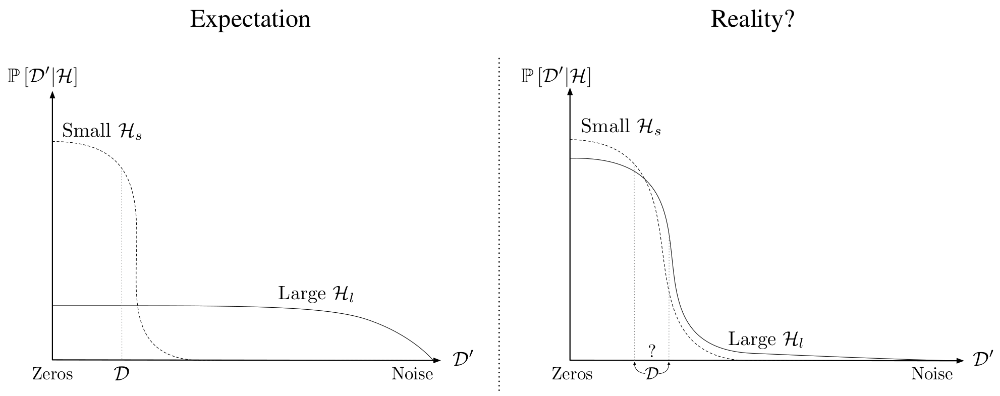

#  Experiments on deep neural networks fitting arbitrary labellings of the training data
The mechanisms underlying hypothesis selection in deep learning remain poorly understood.

In classical machine learning theory, an overly large hypothesis space—such as that associated with overparameterized models—can fit datasets of arbitrary complexity, typically leading to overfitting to the training data and noise. Yet, in practice, deep neural networks routinely achieve state-of-the-art generalization across diverse benchmarks. Paradoxically, the same weakly regularized networks are also capable of perfectly memorizing random label assignments, indicating that stochastic optimization in conjunction with overparameterization can, in principle, memorize the entire training set.

This raises a fundamental question: what factors determine whether a deep network learns meaningful patterns rather than merely memorizing its training data?

In this project we are going to explore established phenomena that set deep networks aside from traditional machine learning

|                                                                         |
| ----------------------------------------------------------------------: |
| Source: [Novak et al. (2018)](https://openreview.net/forum?id=HJC2SzZCW) |
