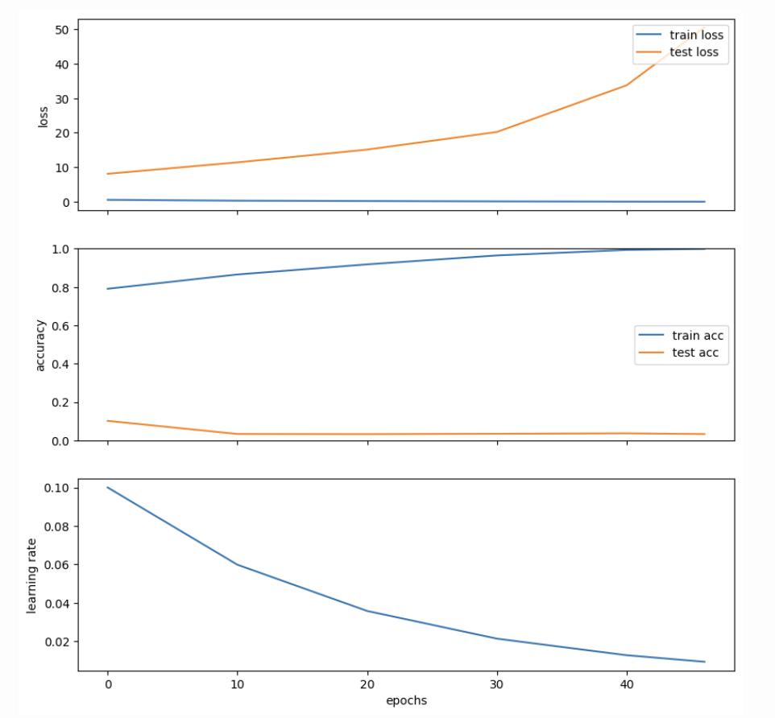
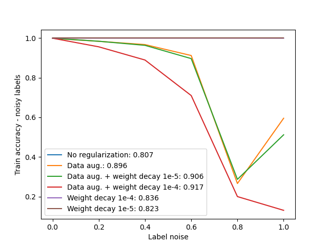
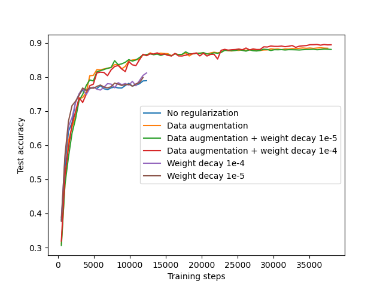

# Memorization in Deep Learning

Experiments on deep neural networks fitting arbitrary labellings of training data, exploring the fundamental question: **What factors govern learning vs. memorization in deep neural networks?**

The mechanisms underlying hypothesis selection in deep learning remain poorly understood. In classical machine learning theory, an overly large hypothesis space—such as that associated with overparameterized models—can fit datasets of arbitrary complexity, typically leading to overfitting to the training data and noise. Yet, in practice, deep neural networks routinely achieve state-of-the-art generalization across diverse benchmarks. Paradoxically, the same weakly regularized networks are also capable of perfectly memorizing random label assignments, indicating that stochastic optimization in conjunction with overparameterization can, in principle, memorize the entire training set.


*Source: [Novak et al. (2018)](https://openreview.net/forum?id=HJC2SzZCW)*

## Overview

This repository contains code to reproduce key experiments from [Zhang et al. (2017)](https://arxiv.org/abs/1611.03530), demonstrating that deep neural networks can fit arbitrary labellings of training data while exploring the role of explicit vs. implicit regularization.

### Key Experiments

1. **Label Corruption**: Train ResNet-18 on CIFAR-10 with varying ratios of corrupted labels (0% to 100%)
2. **Memorization Capacity**: Demonstrate that networks can achieve 100% training accuracy even with completely random labels
3. **Explicit Regularization**: Study the effect of weight decay, data augmentation, and batch normalization
4. **Implicit Regularization**: Explore learning dynamics without explicit regularization


### Requirements

- Python 3.8+
- JAX (with GPU support recommended)
- PyTorch (for data loading only)
- Other dependencies listed in `requirements.txt`


## Project Structure

```
memorisation-dl/
├── configs/
│   └── default_config.py          # Default hyperparameters
├── src/
│   ├── data/
│   │   ├── dataset.py              # Data loading and label corruption
│   │   └── transforms.py           # Custom data transforms
│   ├── models/
│   │   └── resnet.py               # ResNet architecture in JAX/Flax
│   ├── training/
│   │   └── trainer.py              # Training utilities and loops
│   └── utils/
│       ├── __init__.py
│       └── visualization.py        # Plotting utilities
├── experiments/
│   └── run_noise_experiments.py    # Script to run noise ratio experiments
├── figs/                           # Figures and visualizations
├── data/                           # CIFAR-10 dataset (auto-downloaded)
├── checkpoints/                    # Model checkpoints
├── train.py                        # Main training script
└── README.md
```


## Methodology

### Label Corruption

The `corrupt_labels` function implements label corruption by:

1. Randomly selecting a fraction of training samples (determined by `noise_ratio`)
2. Replacing each selected label with a uniformly random class **different** from the original
3. Ensuring reproducibility through fixed random seeds

Mathematically, for a dataset $\mathcal{D} = \{(x_i, y_i)\}_{i=1}^N$, we corrupt labels as:

$$\tilde{y}_i = \begin{cases} 
y_i & \text{with probability } 1 - p \\
\text{Uniform}(\{0, \ldots, C-1\} \setminus \{y_i\}) & \text{with probability } p
\end{cases}$$

where $p$ is the `noise_ratio` and $C$ is the number of classes.

### Loss Function

The training objective is cross-entropy loss with optional L2 weight decay:

$$\mathcal{L}(\theta) = \frac{1}{N}\sum_{i=1}^N \ell_{\text{CE}}(f_\theta(x_i), \tilde{y}_i) + \frac{\lambda}{2}\|\theta\|_2^2$$

where:
- $f_\theta$ is the neural network with parameters $\theta$
- $\ell_{\text{CE}}$ is the softmax cross-entropy loss
- $\lambda$ is the weight decay coefficient
- $\tilde{y}_i$ are the (possibly corrupted) labels

### Learning Rate Schedule

Following Zhang et al. (2017), we use exponential learning rate decay:

$$\eta_t = \eta_0 \cdot \gamma^{t/T}$$

where:
- $\eta_0$ is the initial learning rate (default: 0.1)
- $\gamma$ is the decay rate (default: 0.95)
- $T$ is the decay step in epochs (default: 1)
- $t$ is the current training step

### Stopping Criterion

Training continues until either:
1. Training accuracy reaches 99.9% (memorization achieved)
2. Maximum number of epochs is reached

## Key Results

### Memorization Capability

Deep networks can fit **arbitrary** labellings of the training data:
- With 100% label corruption, ResNet-18 can still achieve near 100% training accuracy
- Test accuracy drops very low though


### Explicit vs Implicit Regularization

**Explicit Regularization** (weight decay, data augmentation, batch norm):
- Helps improve generalization on clean data
- Can slow down memorization but doesn't prevent it entirely
- Not sufficient to explain generalization in practice

The figure depicts the effectiveness of many regularization frameworks at contrasting memorization, by comparing the training accuracy reached under several degrees of label noise. Given a combination of regularization techniques, the best validation accuracy on clean labels is reported in the legend of the plot.



Data augmentation with weight decay seems most effective at hindering memorisation. The technique that gives best validation accuracy on clean labels is data augmentation with weight decay. In the classical machine learning paradigm, it was believed that an overparametrised model without explicit regularisation cannot generalise to unseen data and will only memeorise the training set. We see this to a certain extent in the the experiments we performed before. However I believe this is because the point of double descent has not been reached yet in terms of training time. We now know that with "enough" number of epochs or depth in the network, we are able to get non trivial learning without explicit regularisation No regularization (blue line) still reaches a respectable validation accuracy of 0.807 with clean labels, suggesting that even without explicit regularization, deep networks are capable of learning patterns from the data. However, this comes with a tradeoff—networks without regularization tend to memorize noisy data more, as seen by the blue line's train accuracy being uneffcted with increasing label noise.

**Implicit Regularization** (architecture, optimizer, initialization):
- Even without explicit regularization, networks often learn generalizable patterns. The un-regularised model also seem to achieve non trivial performance. However, techniques like data augmentation and weight decay provide noticeable improvements in stability and slightly higher final test accuracy, making them beneficial for better generalization and achieving top performance.

- SGD dynamics, architecture inductive biases play crucial roles

 Here, many regularization techniques are compared on clean labels, against learning without explicit regularization. All networks have been trained until a target training cross-entropy loss value of $0.19$ was reached.


While explicit regularization provides direct control over model complexity, the implicit biases introduced by optimization algorithms, network architectures, initialization schemes, and training dynamics play a pivotal role in guiding the model towards solutions that generalize well to unseen data. Deep networks are typically highly overparameterized, meaning they have far more parameters than necessary to fit the training data. Paradoxically, this overparameterization seems to help generalization. One explanation is that it allows the network to find simpler solutions (e.g., those with lower norm), as the optimization process often leads to "flatter minima" in the loss landscape, which are correlated with better generalization. Also, Deep networks have a hierarchical structure, allowing them to learn abstract, compositional representations at multiple levels of abstraction (from low-level edges to high-level concepts). This hierarchical feature learning leads to better generalization, especially when combined with sufficient data.

## Implementation Details

### Framework

- **JAX/Flax**: Neural network implementation and training
- **PyTorch**: Data loading (converted to NumPy for JAX)
- **Optax**: Optimizers and learning rate schedules

### Model Architecture

ResNet-18 adapted for CIFAR-10:
- 16 base filters (reduced from 64 for faster training)
- No pre-activation, standard residual connections
- Optional batch normalization
- Global average pooling before classification

### Training Configuration

Default settings (as per assignment):
- **No explicit regularization**: weight_decay=0, no augmentation, no batch norm
- **Batch size**: 128
- **Optimizer**: SGD with momentum 0.9
- **Learning rate**: 0.1 with exponential decay (0.95 per epoch)
- **Max epochs**: 100

## References

1. **[Understanding deep learning requires rethinking generalization](https://arxiv.org/abs/1611.03530)** - Zhang et al., ICLR 2017.
   - Main paper reproduced in this codebase
   
2. **[A Closer Look at Memorization in Deep Networks](https://icml.cc/Conferences/2017/ScheduleMultitrack?event=1327)** - Arpit et al., ICML 2017.
   - Studies memorization dynamics during training
   
3. **[Sensitivity and Generalization in Neural Networks: an Empirical Study](https://openreview.net/forum?id=HJC2SzZCW)** - Novak et al., ICLR 2018.
   - Proposes implicit regularization hypothesis
   
4. **[In Search of the Real Inductive Bias: On the Role of Implicit Regularization in Deep Learning](https://openreview.net/forum?id=6AzZb_7Qo0e)** - Neyshabur, Tomioka, and Srebro, ICLR Workshop 2015.
   - Early work on implicit regularization

## Troubleshooting

### Out of Memory Errors

If you encounter OOM errors with JAX:

```bash
# Limit GPU memory pre-allocation
export XLA_PYTHON_CLIENT_ALLOCATOR=platform
export XLA_PYTHON_CLIENT_MEM_FRACTION=0.80
```

Or modify the code to use CPU:
```python
os.environ['JAX_PLATFORM_NAME'] = 'cpu'
```

### Slow Training

- Reduce `num_filters` (default: 16)
- Increase `batch_size` if memory allows
- Reduce `max_epochs`

## Acknowledgements

- Data loading utilities adapted from [JAX official documentation](https://jax.readthedocs.io/)
- ResNet implementation adapted from [Flax ImageNet example](https://github.com/google/flax/tree/master/examples/imagenet)
- PIL to NumPy transforms adapted from [JAX-ResNet-CIFAR10](https://github.com/hushon/JAX-ResNet-CIFAR10)

## License

This project is for educational purposes as part of a deep learning course assignment.


